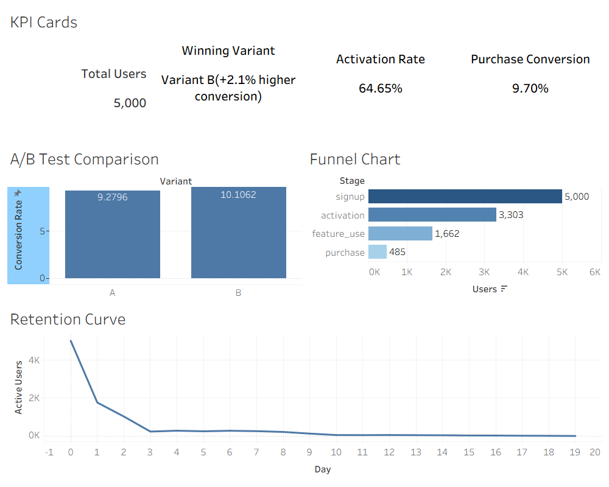

# Product Funnel & User Behavior Analytics

## Project Overview

This project simulates a real-world product analytics workflow used by companies like Spotify, Uber, and Netflix to analyze user behavior, funnel conversion, retention, and A/B testing performance.

The project was built end-to-end using Python, Pandas, Matplotlib, and Tableau.

It includes:
- Synthetic event-level dataset generation
- Funnel conversion analysis
- Drop-off analysis
- Retention analysis
- Churn estimation
- A/B testing with statistical significance
- Interactive Tableau dashboard

---

# Business Problem

Product companies need to understand:
- where users drop off,
- which onboarding flows convert better,
- how retention changes over time,
- and which product changes improve engagement.

This project simulates those analytics workflows using realistic user-event data.

---

# Dataset Description

A synthetic dataset of approximately:

- 5000 users
- 10,000+ events

was generated using Python.

The dataset contains:
- user signup events
- activation events
- feature usage events
- purchase events
- A/B experiment variants

Example schema:

| Column | Description |
|---|---|
| user_id | unique user identifier |
| event | user action |
| timestamp | event timestamp |
| variant | A/B test variant |

---

# Project Workflow

## 1. Data Generation
Generated realistic event-level product analytics data using probabilistic user behavior simulation.

## 2. Funnel Analysis
Calculated:
- conversion rates
- drop-off rates
- funnel stage performance

## 3. Retention Analysis
Analyzed:
- returning users
- retention curves
- churn estimation

## 4. A/B Testing
Compared Variant A vs Variant B using:
- conversion analysis
- chi-square hypothesis testing
- statistical significance testing

## 5. Dashboarding
Built a Tableau dashboard visualizing:
- funnel performance
- retention decay
- A/B test results
- KPI cards

---

# Key Metrics

| Metric | Value |
|---|---|
| Total Users | 5000 |
| Activation Rate | 64.65% |
| Purchase Conversion | 9.70% |
| Winning Variant | Variant B |

---

# Dashboard Preview



---

# Technologies Used

- Python
- Pandas
- NumPy
- Matplotlib
- SciPy
- Tableau Public
- Jupyter Notebook

---

# Statistical Testing

A chi-square test was used to determine whether the difference between A/B test variants was statistically significant.

---

# Key Insights

- Largest drop-off occurred between activation and feature usage.
- Variant B achieved higher purchase conversion than Variant A.
- Retention decayed sharply during early lifecycle stages.
- Funnel analysis identified onboarding and engagement bottlenecks.

---

# How to Run the Project

## Clone Repository

```bash
git clone <https://github.com/bhavib104/product-funnel-analytics>
```

## Install Dependencies

```bash
pip install -r requirements.txt
```

## Run Jupyter Notebook

```bash
jupyter notebook
```

---

# Future Improvements

- Real-time dashboard integration
- SQL warehouse integration
- Predictive churn modeling
- Session-level analytics
- User segmentation analysis

---

# Author

Bhavi Bhatt